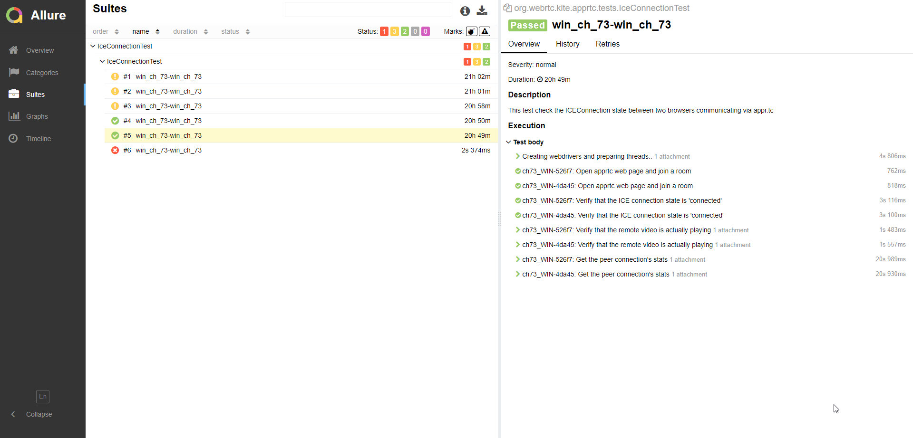

# This is KITE 2.0, Karoshi Interoperability Testing Engine (version 2.0)

The effortless way to test WebRTC compliance, prevent [Karoshi](https://en.wikipedia.org/wiki/Kar%C5%8Dshi) with __KITE!__

Write automated interoperability test scripts in Java or Javascript and run them on any platforms. KITE supports:  
 * all web browser: Chrome, Firefox, Safari, Edge, Opera... on all OS (Linux, Windows, Mac, iOS and Android)
 * Mobile Native Apps on Android, iOS
 * Desktop Native Apps on Windows and MacOS
 * Electron Apps 


__KITE__ can be setup on Windows, Mac or Linux.  The installation process only takes 10 to 15 minutes.  

Additional free WebRTC sample tests are available https://github.com/CoSMoSoftware/KITE-Sample-Tests  
The sample tests cover all the major open-source SFUs demos:  
 * Jisti
 * Janus
 * Kurento/openvidu
 * Mediasoup
 * Medooze (Simulcast demo)


__KITE__ also supports additional features such as:
 * Load Testing (> 100,000 clients)
 * Native Apps Testing on Android, iOS, Windows and MacOS
 * Network Instrumentation in the cloud or on premises, for all platforms (browser and native)
Please contact [contact@cosmosoftware.io](mailto:contact@cosmosoftware.io) for more information.  


#### Tutorials: Writing a simple KITE Test for Jitsi in Java and/or Javascript

Once you've completed the installation and run the sample tests, pleaae try to write your own KITE test following our tutorials.  
 * [KITE Test for Jitsi in Java](tutorial/Tutorial_Java.md)
 * [KITE Test for Jitsi in Javascript](tutorial/Tutorial_Javascript.md)


#### _This is not an official Google product_

See [LICENSE](LICENSE) for licensing.
&nbsp;    

## A. Install prerequisite software  

You will need Git, JDK 8 and Maven. 

#### Git

You can download it from:  
[Git](https://git-scm.com/downloads)  

#### Java Development Kit 8

You can download it from:  
[JDK 8](https://www.oracle.com/technetwork/java/javase/downloads/jdk8-downloads-2133151.html)  

##### Maven installation

If you are not familiar with Maven and/or new to the concept of PATH and environmnent variables, Maven's
 installation can prove quite tricky as it requires you to add JAVA_HOME to
 your environment variables and MAVEN/bin to your PATH. To make this easier, we're providing an installation script. 
 If you would like to use our script to install Maven, you can skip it for now and install it after cloning the git repo
 (following the instructions at B.2.).
 
Alternatively, if you are familiar with setting up Maven and configuring the PATH and environment variables, you can download [Maven](https://maven.apache.org/download.cgi?Preferred=ftp://mirror.reverse.net/pub/apache/) from  
https://maven.apache.org/download.cgi

The following guides could help you:
* On Windows: https://www.mkyong.com/maven/how-to-install-maven-in-windows/
* On Ubuntu: https://www.mkyong.com/maven/how-to-install-maven-in-ubuntu/
* On Mac: https://www.mkyong.com/maven/install-maven-on-mac-osx/


To verify your setup, in a new command prompt or shell terminal, type:
``` 
mvn -version
```
Expected output (for example on Windows 10):
```
Apache Maven 3.6.1
Maven home: C:\Program Files\Maven\apache-maven-3.6.1\bin\..
Java version: 1.8.0_191, vendor: Oracle Corporation
Java home: C:\Program Files\Java\jdk1.8.0_191\jre
Default locale: en_US, platform encoding: Cp1252
OS name: "windows 10", version: "10.0", arch: "amd64", family: "windows"
```

Install your favorite Java IDE. We recommend [IntelliJ IDEA Community](https://www.jetbrains.com/idea/download) but you can use Eclipe or any other IDE if you prefer.
&nbsp;    

If you are on Mac and are using zsh, please make sure to add the following line add the end of your `~/.zshrc` file:
``` 
source .bash_profile
```

## B. Install KITE 2.0

1. Clone this repo into a folder __without any space__, for example under `\GitHub\`:  
     
    ```
    mkdir GitHub
    cd GitHub
    git clone https://github.com/webrtc/KITE.git
    cd KITE
    ```

2. Maven installation

    If you haven't installed Maven yet, you can install it using the installMaven script.
 
    On Windows, open a Command Prompt window and enter the following commands:

    ```
    scripts/windows/installMaven.bat
    ```

    On Linux, open a terminal and enter the following commands:
    ```
    chmod -R +x scripts/linux
    scripts/linux/installMaven.sh
    ```     
    
    2.3 On Mac, open a terminal and enter the following commands:
    ```
    chmod -R +x scripts/mac
    scripts/mac/installMaven.sh
    ```
    
3. Configure __KITE__  


    This will set KITE_HOME environment variable and add utility scripts to your path.  

    3.1 On Windows, open a Command Prompt window and enter the following commands:
    ```
    configure.bat
    ```

    3.2 On Linux, open a terminal and enter the following commands:
    ```
    chmod +x configureLinux.sh
    ./configureLinux.sh
    ```     
    
    3.3 On Mac, open a terminal and enter the following commands:
    ```
    chmod +x configureMac.command  
    ./configureMac.command
    ```
    
    During this step, you will be prompt to setup the local grid. This is an interactive setup. 
    It is important to configure the Firefox and Chrome versions according to the versions installed on your computer.  
    If Chrome and/or Firefox are not installed, this script will automatically download and install the latest stable releases. 
          
    To check the browser versions:  
    __1. Chrome__  
    Open Chrome and enter <a href="chrome://settings/help" target="_blank">chrome://settings/help</a> into the address bar.
       
    __2. Firefox__  
    Open Firefox, top right menu, then select Help, then About Firefox. You can also find out the latest version
     at [www.mozilla.org/en-US/firefox/releases/](https://www.mozilla.org/en-US/firefox/releases/).
    
    Different browser versions require a different ChromeDriver (to control Chrome) and a different GeckoDriver (to control Firefox).
    You will need to find out what are the corresponding driver versions. Please visit the following two pages:
    * http://chromedriver.chromium.org/downloads
    * https://github.com/mozilla/geckodriver/releases  
 
    By default, the local grid setup script is configured for __Chrome__ version __86__ and __Firefox__ version __82__. 
    If these are the versions installed on your computer, you can safely use the default settings.
    Otherwise, you will need to edit the following settings when prompt to do so:  
    
    ```
    CHROME_VERSION=86
    FIREFOX_VERSION=82
    CHROMEDRIVER_VERSION=86.0.4103.39
    GECKO_VERSION=v0.26.0
    ```
    
    __Note:__ Please input only the major (i.e. 86 or 82) for the browser versions, but the full version with the minor (i.e. 86.0.4103.39 or v0.26.0) for the driver versions.     
   The latest version of ChromeDriver is available at: https://chromedriver.storage.googleapis.com/LATEST_RELEASE
   More details are available in the [local grid setup guide](scripts/README.md).
    
    __3. Safari__  
    Safari is installed by default on MacOS, there is no need to download anything. You will only need to enable the 'Allow Remote Automation' option in Safari's Developer menu so it can be automated by KITE for testing.
    
    
4. Compile 

    
__On Windows:__  
    Just type `c` (which will execute `mvn clean install -DskipTests`). 
    
    ```
    cd %KITE_HOME%
    c
    ```

If you are within a test folder, for example in KITE-AppRTC-Test, you can type __`c`__ to compile the test module
only or __`c all`__ to recompile the entire project:

    ```
    cd %KITE_HOME%\KITE-AppRTC-Test  
    c all
    ```  
__On Linux/Mac:__  
Just type `c` (which will execute `mvn clean install -DskipTests`).
    ```
    cd $KITE_HOME
    c
    ```
If you are within a test folder, for example in KITE-AppRTC-Test, you can type __`c`__ to compile the test module
 only or __`c all`__ to recompile the entire project:  

    ```
    cd $KITE_HOME/KITE-AppRTC-Test
    c all
    ```


## C. Install the local grid

If you have chosen to skip the grid installation during configure, you can still do it
by following [local grid setup guide](scripts/README.md).
  
&nbsp;    
&nbsp;      
      

    
## D. Run the sample tests


__Note:__ You will need to have your [local grid](scripts/README.md) running before you can execute any test.  
You can check if your local grid is running and the browser versions installed by 
opening the [Grid Console](http://localhost:4444/grid/console).
In the following example, we are assuming __Chrome__ version __86__ and __Firefox__ version __82__.


### Edit the test config file

If your Grid is running on localhost and with __Chrome__ version __86__ and __Firefox__ version __82__ you can skip this step.

Edit the file `./KITE-Example-Test/configs/search.local.config.json` with your favorite text editor. 

#### Version 
You will need to change __`version`__ according to what is installed on your local grid.
For example, if the latest stable version of __Chrome__ is __86__, you should set: 
```json
      "browserName": "chrome",
      "version": "86",
      "platform": "localhost",
```

#### Platform 
When KITE is running on the same computer as the Grid, it will detect the OS and interpret the plaform "localhost" and translate it to WINDOWS, LINUX or MAC.  
If you want to run KITE against a Grid that is running on a different computer, you will need to change the platform according to what's available on your Grid
 and you will need to change the platform to "WINDOWS" to "LINUX" or "MAC". 
 
Example for Windows:  

```json
      "browserName": "chrome",
      "version": "86",
      "platform": "WINDOWS",
```
You can find more information about the Basic Configuration File [here](#basic-configuration-file).


### Run KITE-Example-Test


To run the example test,  

__On Windows:__ 
```
cd %KITE_HOME%\KITE-Example-Test
r configs\search.local.config.json
```
__On Linux/Mac:__   
```
cd $KITE_HOME/KITE-Example-Test
r configs/search.local.config.json
```


### Run KITE-AppRTC-Test

Edit the file `./KITE-AppRTC-Test/configs/iceconnection.apprtc.config.json` with your favorite text editor.  
You will need to change __`version`__ and __`platform`__ according to what is installed on your local grid.

To run the AppRTC iceconnection test,

__On Windows:__  
```
cd %KITE_HOME%\KITE-AppRTC-Test
r configs\iceconnection.apprtc.config.json
```
__On Linux/Mac:__   
```
cd $KITE_HOME/KITE-AppRTC-Test
r configs/iceconnection.apprtc.config.json
```

Alternatively, you can launch the test with the full command.  

__On Windows:__    
```
java -Dkite.firefox.profile="%KITE_HOME%"/third_party/firefox-h264-profiles/ -cp "%KITE_HOME%/KITE-Engine/target/kite-jar-with-dependencies.jar;target/*" org.webrtc.kite.Engine configs/iceconnection.apprtc.config.json
```
__On Linux/Mac:__  
```
java -Dkite.firefox.profile="$KITE_HOME"/third_party/firefox-h264-profiles/ -cp "$KITE_HOME/KITE-Engine/target/kite-jar-with-dependencies.jar:target/*" org.webrtc.kite.Engine configs/iceconnection.apprtc.config.json
```

### Open the dashboard

After running the test, you can open the Allure dashboard with the command `a`.

__On Windows:__  
```
cd %KITE_HOME%\KITE-AppRTC-Test
a
```
__On Linux/Mac:__  
```
cd $KITE_HOME/KITE-AppRTC-Test
a
```

Congratulation! You should see the results of your first KITE test.

  


Alternatively, the full command to launch the Allure dashboard is:  
```
allure serve kite-allure-reports
```


## Basic configuration file

The example search.local.config.json file is almost the simplest config file you can get
 (Change the version of browsers to the appropriated one that you have installed on your testing machine):

```json
{
  "name": "Kite test example (with Allure reporting)",
  "callback": null,
  "grids": [
    {
      "type": "local",
      "url": "http://localhost:4444/wd/hub"
    }
  ],
  "tests": [
    {
      "name": "KiteExampleSearchTest",
      "tupleSize": 1,
      "description": "This example test opens google and searches for Cosmo Software Consulting and verify the first result",
      "testImpl": "org.webrtc.kite.example.KiteExampleSearchTest",
      "payload" : {
        "test1": "ONE",
        "test2": "TWO"
      }
    }
  ],
  "clients": [
    {
      "browserName": "chrome",
      "version": "86",
      "platform": "WINDOWS",
      "flags": []
    },
    {
      "browserName": "firefox",
      "version": "82",
      "platform": "WINDOWS",
      "flags": []
    }
  ]
}

```

It registers only selenium server in the local machine:
```json
  "grids": [
    {
      "type": "local",
      "url": "http://localhost:4444/wd/hub"
    }
  ],
```

It registers IceConnectionTest class as a test (this class is implemented in KITE-AppRTC-Test)
```json
  "tests": [
    {
      "name": "KiteExampleSearchTest",
      "tupleSize": 1,
      "description": "This example test opens google and searches for Cosmo Software Consulting and verify the first result",
      "testImpl": "org.webrtc.kite.example.KiteExampleSearchTest",
      "payload" : {
        "test1": "ONE",
        "test2": "TWO"
      }
    }
  ],
```

It requests for firefox and chrome. Version and platform are required fields. Version and platform actually used in the tests will be reported in the result, and will appear in the dashboard.

Sample config files in `KITE-Example-Test/configs` contain the example with different browser, version and platform configuration, take a closer look

```json
  "clients": [
    {
      "browserName": "chrome",
      "version": "86",
      "platform": "LINUX",
      "flags": []
    },
    {
      "browserName": "firefox",
      "version": "82",
      "platform": "MAC",
      "flags": []
    }
  ]
```

If the grid is running on localhost (same machine as KITE), then you can use `localhost` as the platform name, KITE will automatically set
 it according to your OS. However, if the grid or selenium node is not running on localhost, you must set the platform name according to
  the OS of the node (MAC, WINDOWS, LINUX, Android...)  

## Upload result files to a different machine

One can upload its result files with FTP on a different machine. 
For this, a FTP server should run on the target machine. 
Host IP, port, username and password can be added to the config file. An example:
```json
  "tests": [
    {
      "name": "KiteExampleSearchTest",
      "tupleSize": 1,
      "description": "This example test opens google and searches for Cosmo Software Consulting and verify the first result",
      "testImpl": "org.webrtc.kite.example.KiteExampleSearchTest",
      "callbackUrl": "192.168.1.2",
      "callbackPort": 2221,
      "callbackUsername" : "username",
      "callbackPassword": "password",
      "payload" : {
        "test1": "ONE",
        "test2": "TWO"
      }
    }
  ],
```
If filled, KITE will zip the result files, then try to connect to the machine and upload the archives to the working directory. 
One use of this is, when the FTP server is configured to handle these archives, it can unzip the archives and generate the report to a directory served by a webserver:
```
allure generate . --output /var/www/results
```
