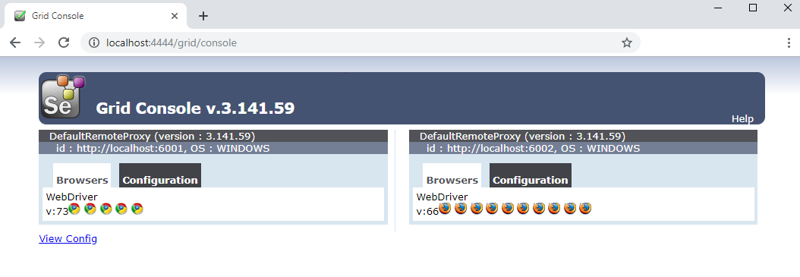

[back](../README.md)

# Local Grid Setup Guide

This guide will assist you in setting up a local Selenium Grid on your computer with a Selenium Hub, one Selenium Node for
Chrome, one Node for Firefox and if you're using a Mac, one Node for Safari.

Table of Content  
- [Step 1 Check latest Chrome and Firefox stable version](#Step-1-Check-latest-Chrome-and-Firefox-stable-version)  
- [Step 2 Configure the script](#Step-2-Configure-the-script)  
- [Step 3 Install the local grid](#Step-3-Install-the-local-grid)  
- [Explanations and troubleshooting](#Explanations-and-troubleshooting)


## Step 1 Check latest Chrome and Firefox stable version

The first step is to find out the version of Chrome and Firefox that are installed on your computer.  
If Chrome and/or Firefox are not installed, this script will automatically download and install the latest stable releases. 

To check the browser versions:  
__1. Chrome__  
Open Chrome and enter <a href="chrome://settings/help" target="_blank">chrome://settings/help</a> into the address bar.
   
__2. Firefox__  
Open Firefox, top right menu, then select Help, then About Firefox. You can also find out the latest version
 at [www.mozilla.org/en-US/firefox/releases/](https://www.mozilla.org/en-US/firefox/releases/).


By default, the local grid setup script is configured for __Chrome__ version __80__ and __Firefox__ version __68__.  
If these are the versions already installed on your computer, you can skip __Step 2: configure the script__ and
 jump directly to __Step 3: install the local grid.__ 

&nbsp;    
&nbsp;  


__NOTE:__ _This script only works on Windows 10. On Windows 7, several steps needs to be done manually._ 

## Step 2 Configure the script

Now that you know what the latest stable versions of Chrome and Firefox are, please open a command prompt/terminal and enter the following commands.:
### Windows 10
```
cd %KITE_HOME%\scripts\windows
notepad gridConfig.bat
```  
### Ubuntu
```
cd $KITE_HOME/scripts/linux
nano gridConfig.sh
```  
### Mac
```
cd $KITE_HOME/scripts/mac
open -a TextEdit gridConfig.sh
```  


Scroll down to the end of the file and edit the following parameters with the versions corresponding to the latest stable releases versions.
 Please only input the major (only 80 and not 81.0.4044.69).
```
rem Browser versions
set CHROME_VERSION=87
set FIREFOX_VERSION=83
```

Different browser versions require a different ChromeDriver (to control Chrome) and a different GeckoDriver (to control Firefox).
You will need to find out what are the corresponding driver version. Please visit the following two pages:
* http://chromedriver.chromium.org/downloads
* https://github.com/mozilla/geckodriver/releases
 
 And edit the following values in gridConfig.bat accordingly. This time, please input the full version with the minor (81.0.4044.69 and not 80).
```
rem ChromeDriver and GeckoDriver versions
set CHROMEDRIVER_VERSION=87.0.4280.88
set GECKO_VERSION=v0.26.0
```

You might also want to check the __Selenium Standalone Server__ version. At the time of writing this, the latest version was 3.141.59 and was compatible with
all recent ChromeDriver and GeckoDriver releases. You can find out the latest __Selenium Standalone Server__ version at: https://www.seleniumhq.org/download/. 

Now, please save the file `gridConfig.bat` and you should be all set to run the local grid setup script.


## Step 3 Install the local grid

Open a command prompt and enter the following commands:

### Windows 10
```
cd %KITE_HOME%\scripts\windows
setupLocalGrid.bat
```  

### Ubuntu
```
cd $KITE_HOME/scripts/linux
chmod +x *.sh
./setupLocalGrid.sh
```  

### Mac
```
cd $KITE_HOME/scripts/mac
chmod +x *.sh
chmod +x *.command
./setupLocalGrid.command
```  
On Mac, if you see a confirmation window when running the script, just open it with a text editor and click on open, 
you should then be able to run the script by clicking on it.  

__Safari setup__: Safari is installed by default on MacOS, but in order to be controlled by KITE, you need to
 enable the 'Allow Remote Automation' option in Safari's Developer menu to control Safari via WebDriver.


&nbsp;    
&nbsp;  
The script will open a couple of windows to download and install the browsers, drivers and selenium on your computer.
Please wait for all the download and installation to complete as the script asks you, then press a key to launch the grid.  

That's it. Congratulation, you have setup a local grid on your computer ready to be used for your tests.
Open the [Grid Console](http://localhost:4444/grid/console). You should see two Selenium nodes, one for Firefox and one for Chrome.
  

If you have any issue, please check out [Explanations and troubleshooting](#Explanations-and-troubleshooting) section.


&nbsp;    
&nbsp;      
    

## Explanations and troubleshooting

__Note:__ _the script file extensions have been omitted in this paragraph, they are respectively `.bat` on Windows, `.sh` on Linux and `.command` on Mac._
  
&nbsp;    
The script `setupLocalGrid` will execute the following scripts in order.  

```
createFolderLocalGrid
```
This will create the `localGrid/` in your KITE installation directory (%KITE_HOME% on Windows and $KITE_HOME on Linux/Mac).  
It will also create the subfolders `localGrid/chrome/`, `localGrid/hub/` and `localGrid/firefox/`.  
Finally, it will also generate the scripts that starts and stop the grid, namely:
```
localGrid/startGrid
localGrid/stopGrid
localGrid/hub/startHub
localGrid/chrome/startNode
localGrid/firefox/startNode
```  
&nbsp;    
```
installChrome
```
This will check which version of Google Chrome is installed on your computer, if it is not the one you specified in your `gridConfig`, it will install the latest version of Chrome.  
This doesn't work on Windows 7. Please download and install Chrome manually from:
* https://www.google.com/chrome/b/

&nbsp;    
```
installFirefox
```
This will check which version of Mozilla Firefox is installed on your computer, if it is not the one you specified in your `gridConfig`, it will install the latest version of Firefox.  
This doesn't work on Windows 7. Please download and install Firefox manually from:
* https://www.mozilla.org/en-US/firefox/new/
&nbsp;    
```
installDrivers
```
This will download the version of chromedriver and selenium driver you specified in your `gridConfig`, it will then unzip them and move them to the localGrid folder.
This doesn't work on Windows 7. Please download and install ChromeDriver and GeckoDriver manually from:
* http://chromedriver.chromium.org/downloads
* https://github.com/mozilla/geckodriver/releases
And save the ChromeDriver.exe into the folder `localGrid\chrome\` and the GeckoDriver.exe into `localGrid\firefox\`
&nbsp;    
```
installSelenium
```
This will download the version of selenium standalone server you specified in your `gridConfig` and move it to the localGrid folder.
This doesn't work on Windows 7. Please download __Selenium Standalone Server__ manually from:
* https://www.seleniumhq.org/download/
And rename the file to `selenium.jar` and save it to the folder `localGrid\`.


Once all those scripts are over, you will be able to launch the local grid by running the `localGrid/startGrid` script from the localGrid folder.


