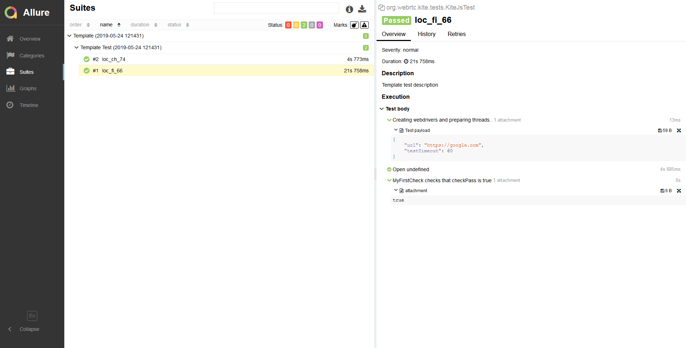
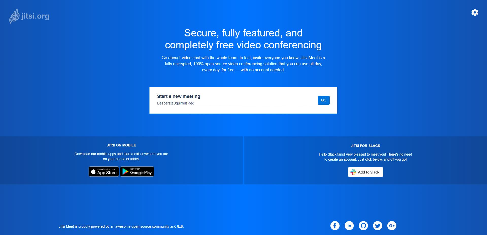
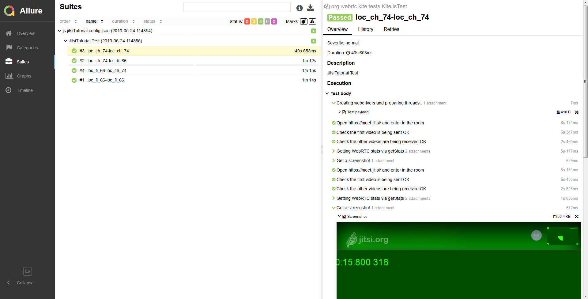

# Tutorial: Writing a KITE Test for Jitsi in Java
*****
This tutorial will guide you step-by-step in writing your first KITE Test. The test will open the https://meet.jit.si/ page on a web browser (Chrome and Firefox), check the sent and received videos, collect the WebRTC statistics and take a screenshot.  

1. Create the Test
2. Adding the first Step: open https://meet.jit.si/ page
3. Adding the Main Page
4. Adding the Checks 
    1. Sent Video Check
    2. Received Videos Check
5. Step: collect WebRTC Stats
6. Step: taking a Screenshot
7. Understanding KITE Test
&nbsp;

This is the Project Skeleton:   


**Please refer when creating Java Files for each Part of this tutorial**

You can find the full source code of this tutorial [here](https://github.com/CoSMoSoftware/KITE-JitsiTutorial-Test).

### KITE Test Design Pattern

KITE Tests are implemented in a framework that follows the Page Object Model design pattern [(POM)](https://medium.com/tech-tajawal/page-object-model-pom-design-pattern-f9588630800b), and organises a Test in Pages, Steps and Checks.  
Using Page Object Model, all element locators are being managed in separate directory and can be updated easily without any change in test cases.  
A Test consists of a succession of Steps and Checks:
- Steps are actions, for example, navigate to a page or click a button. Steps are not expected to fail, they either 'Pass' or 'Break' (any unexpected error).
- Checks are assertations, for example, validate that a video is playing. Checks can 'Pass' (video is playing), 'Fail' (video is blank/still) or 'Break' (e.g. page timeout). 

Pages are where we place the element locators and the functions to interact with them.


*****

### 1. Create the Test

To create the test, execute the following commands:

__On Windows:__  
```
cd %KITE_HOME%
kite_init jitsiTutorial
c
```
__On Linux/Mac:__   
```
cd $KITE_HOME
kite_init jitsiTutorial
c
```

This will create KITE-JitsiTutorial-Test and with inside, all the basic files and folders used in all KITE Tests, for both Java and Javascript.
This tutorial is about the Java KITE Test and all the Java files are located in `KITE-JitsiTutorial-Test/src/main/java/org/webrtc/kite/jitsitutorial/`.   
Let's have a look at the files and folders generated in  `KITE-JitsiTutorial-Test/src/main/java/org/webrtc/kite/jitsitutorial/`.  

#### KITE Test Class
The file `KiteJitsiTutorialTest.java` is the entry point of the test. It extends `KiteBaseTest` class and includes the list of Steps.
```java
package org.webrtc.kite.jitsitutorial;

import org.webrtc.kite.jitsitutorial.checks.MyFirstCheck;
import org.webrtc.kite.jitsitutorial.steps.OpenUrlStep;
import org.webrtc.kite.tests.KiteBaseTest;
import org.webrtc.kite.tests.TestRunner;

public class KiteJitsiTutorialTest extends KiteBaseTest {
  
  private String url = "https://google.com";
  
  @Override
  protected void payloadHandling() {
    if (this.payload != null) {
      url = payload.getString("url", url);
    }
  }

  @Override
  public void populateTestSteps(TestRunner runner) {
    runner.addStep(new OpenUrlStep(runner.getWebDriver(), url));
    runner.addStep(new MyFirstCheck(runner.getWebDriver()));
  }

}
```

#### Folders

The `kite_init` script generated 3 subfolders:
```
- KITE-JitsiTutorial-Test/src/main/java/org/webrtc/kite/jitsitutorial/pages/
- KITE-JitsiTutorial-Test/src/main/java/org/webrtc/kite/jitsitutorial/steps/
- KITE-JitsiTutorial-Test/src/main/java/org/webrtc/kite/jitsitutorial/checks/
```
This is where we will respectively implement the Pages, Steps and Checks of the test, following the Page Object Model design pattern.


#### Config file. 

The KITE config file of our java KITE test can be found at  `KITE-JitsiTutorial-Test/configs/jitsiTutorial.config.json`
This file contains all the information for the tests.

**name**: name of the configuration file.
**remotes**: the address of the selenium hub.
**tests**: a list containing all the tests to be run. Each test contains all the necessary information for its progress.
In each test we can find:
- **name**: name of the test
- **description**: description of the test
- **tupleSize**: number of browsers launched at the same time
- **testImpl**: name of the JS test file
- **payload** contains name:values pairs to run the tests.
List of all the browsers that will be tested:
**browsers**

*****
Once done, we can already run the test with:
```
r configs\jitsiTutorial.config.json
```
At this stage, the test only launch a web browser, open https://meet.jit.si/ and does a random check.

Open the Allure Report with:
```
a
```
The report should look like this:  
    

*****
### 2. Adding a Step: open https://meet.jit.si/ page

The file `/steps/OpenUrlStep.java` was generated by the `kite_init` script. It already contains everything required for this Step and does not require any modification.  

**TestStep** is the parent class that enables the Allure Report generation.

The constructor of each Step must contain the WebDriver object. It is needed for the Step to control the web browser and execute what it needs to do.  
Next, the constructor will include the other variables and objects needed for the Step, in this case, the url of the web page to open.

⚠ To create a Step or a Check, we must implement two functions, **stepDescription()** and **step()**, which are abstract functions of the parent class **TestStep**.

**stepDescription()** returns a string which will be displayed in the report.

**step()** is the function that will be called by KITE when the Step is to be executed.


*****
### 3. Adding the Main page

Similarly to the Steps which are placed in the `steps/` folder, the Pages are placed in the `pages/` package.
The `kite_init` script created the java class file:  `pages/MainPage.java`  
Here we're going to edit `pages/MainPage.java` and add the HTML locators and functions that interact with the web page.
 
To add HTML locators, we are going to use the class `By` from [Selenium-webdriver](https://seleniumhq.github.io/selenium/docs/api/java/org/openqa/selenium/By.html).
Here, we'll use the text input to choose our meeting room;

First open [Jitsi](https://meet.jit.si/).  
</br>
Click go to enter Jitsi MainPage and join a room.    

Inspect the Page by pressing Ctrl + Shift + i      
Then, press Ctrl + Shift + c and click on the room text field which will identify room text field element 

</br></br>
Go back to MainPage.java and add the following code: 
```java
@FindBy(xpath = "//*[@id=\"new-toolbox\"]/div[2]/div[3]/div[1]/div/div") //Find toggle button with xpath since id not provided
private WebElement manyTilesVideoToggle; //button to view all videos on meeting page at same size

@FindBy(tagName = "video")  //Find by tagName
private List<WebElement> videos;    //List of all the videos on a page
```
Press Alt + Enter to import classes required
Create some useful functions that will be used for creating test steps or checks 
```java
public void clickVideoToggle() {    //click manyTilesVideotoggle
    manyTilesVideoToggle.click();
  }

  public void videoIsPublishing(int timeout) throws TimeoutException {  //check video is publishing
    WebDriverWait wait = new WebDriverWait(webDriver, timeout);
    wait.until(ExpectedConditions.visibilityOf(videos.get(0)));
  }

  public int numberOfVideos() { //return number of videos
    return videos.size();
  }

  public List<WebElement> getVideoElements() {  //return list of video elements
    return videos;
  }
  //JavaScript code to save peerConnections Object in window.pc variable in browser
  //This sciprt will be executed at get statistics step
  public String getPeerConnectionScript() {
    return "window.pc = [];"
        + "map = APP.conference._room.rtc.peerConnections;"
        + "for(var key of map.keys()){"
        + "  window.pc.push(map.get(key).peerconnection);"
        + "}";
  }
```
**Great work! The MainPage is done!**

### 4. Adding the Checks (Sent and Received Videos Check)
Step and Check both inherit from TestStep class. They work the same way, but are put in different packages for better organisation.
#### i. Sent Video Check
First, we will create SentVideoCheck.java in the checks package:`org.webrtc.kite.jitsitutorial.checks`  
Next, we will create a empty class structure for the video check that inherits TestStep 
**This structure applies to all test steps/checks** 
```java
package org.webrtc.kite.jitsitutorial.checks;

import io.cosmosoftware.kite.exception.KiteTestException;
import io.cosmosoftware.kite.steps.TestStep;
import org.openqa.selenium.WebDriver;

public class SentVideoCheck extends TestStep {
  public SentVideoCheck(WebDriver webDriver) {
    super(webDriver);
  }

  @Override
  public String stepDescription() {
    return null;
  }

  @Override
  protected void step() throws KiteTestException {}
}
```
Next, we will implement the method for **stepDescrpition()** and **step()** as TestStep is an **abstract** class    
```java
public String stepDescription() {   //step description that will be displayed on test report
    return "Checking if Sent Video is playing properly";
}
```
**step()** is the main function of a step/check that controls the test environment and WebDriver.   
In this case, we want to use the WebDriver to help us check if the video we sent is playing.        
```java
protected void step() throws KiteTestException {
    try {
      final MainPage meetingPage = new MainPage(this.webDriver, logger);
      meetingPage.videoIsPublishing(10); //wait until video is publishing
      logger.info("Looking for video object");
      List<WebElement> videos = meetingPage.getVideoElements(); //get video elements
      if (videos.isEmpty()) {
        throw new KiteTestException(
            "Unable to find any <video> element on the page", Status.FAILED);
      }

      String videoCheck = videoCheck(webDriver, 0); //check local video located at index 0, returns status of video
      if (!"video".equalsIgnoreCase(videoCheck)) {
        //add test failure status to report
        Reporter.getInstance().textAttachment(report, "Sent Video", videoCheck, "plain");
        throw new KiteTestException("The first video is " + videoCheck, Status.FAILED);
      }
    } catch (KiteTestException e) {
      throw e;
    } catch (Exception e) {
      throw new KiteTestException("Error looking for the video", Status.BROKEN, e);
    }
  }
 ```

In the end, SentVideoCheck.java should look like this:  
```java
package org.webrtc.kite.jitsitutorial.checks;

import io.cosmosoftware.kite.exception.KiteTestException;
import io.cosmosoftware.kite.report.Reporter;
import io.cosmosoftware.kite.report.Status;
import io.cosmosoftware.kite.steps.TestStep;
import org.openqa.selenium.WebDriver;
import org.openqa.selenium.WebElement;
import org.webrtc.kite.jitsitutorial.pages.MainPage;

import java.util.List;

import static io.cosmosoftware.kite.util.TestUtils.videoCheck;

public class SentVideoCheck extends TestStep { //notice it inherits from TestStep

  public SentVideoCheck(WebDriver webDriver) {
    super(webDriver);
  }

  @Override
  public String stepDescription() {
    return "Checking if Sent Video is playing properly";
  }

  @Override
  protected void step() throws KiteTestException {
    try {
      final MainPage meetingPage = new MainPage(this.webDriver, logger);
      meetingPage.videoIsPublishing(10);
      logger.info("Looking for video object");
      List<WebElement> videos = meetingPage.getVideoElements();
      if (videos.isEmpty()) {
        throw new KiteTestException(
            "Unable to find any <video> element on the page", Status.FAILED);
      }

      String videoCheck = videoCheck(webDriver, 0); // function from TestUtils
      if (!"video".equalsIgnoreCase(videoCheck)) {
        //add test failure status to report
        Reporter.getInstance().textAttachment(report, "Sent Video", videoCheck, "plain");
        throw new KiteTestException("The first video is " + videoCheck, Status.FAILED);
      }
    } catch (KiteTestException e) {
      throw e;
    } catch (Exception e) {
      throw new KiteTestException("Error looking for the video", Status.BROKEN, e);
    }
  }
}

```
#### ii. Received Videos Check
First, we will create ReceivedVideosCheck.java in the checks package: `org.webrtc.kite.jitsitutorial.checks`
Create the empty class structure that extends TestStep
```java
package org.webrtc.kite.jitsitutorial.checks;

import io.cosmosoftware.kite.exception.KiteTestException;
import io.cosmosoftware.kite.steps.TestStep;
import org.openqa.selenium.WebDriver;

public class ReceivedVideosCheck extends TestStep {
  public ReceivedVideosCheck(WebDriver webDriver) {
    super(webDriver);
  }

  @Override
  public String stepDescription() {
    return null;
  }

  @Override
  protected void step() throws KiteTestException {}
}
```
The class constructor is flexible, you can add another class attribute.
We will create ReceivedVideosCheck constructor with an additional attribute, **numberOfParticipants**
```java
public ReceivedVideosCheck(WebDriver webDriver, int numberOfParticipants) {
    super(webDriver);
    this.numberOfParticipants = numberOfParticipants;
}
```
Next, we will implement the method for **stepDescrpition()** and **step()** as TestStep is an **abstract** class
```java
public String stepDescription() {
    return "Check the other videos are being received OK";
}
```
**step()** is the main function of a step/check that controls the test environment and WebDriver.
In this case, we want to use WebDriver to check if all the videos being received are playing properly.  
1.  Wait for a period of time for the videos to load, you can increase the wait time for slower pc    
2.  Check that there are equal number of video elements and participants
3.  If step 2 passed, use KITE Utils's video check method to test each video element. 
4.  if video is not playing properly, post video check results to report and throw KiteTestException and the test will stop

```java
protected void step() throws KiteTestException {
    try {
      final MainPage meetingPage = new MainPage(this.webDriver, logger);
      // wait a while to allow all videos to load.
      waitAround(numberOfParticipants * 3 * ONE_SECOND_INTERVAL);
      meetingPage.clickVideoToggle();
      logger.info("Looking for video elements");
      if (meetingPage.numberOfVideos() < numberOfParticipants) {
        throw new KiteTestException(
            "Unable to find "
                + numberOfParticipants
                + " <video> element on the page. No video found = "
                + meetingPage.numberOfVideos(),
            Status.FAILED);
      }
      String videoCheck = "";
      boolean error = false;
      for (int i = 1; i < numberOfParticipants; i++) {
        String v = videoCheck(webDriver, i);
        videoCheck += v;
        if (i < numberOfParticipants - 1) {
          videoCheck += "|";
        }
        if (!"video".equalsIgnoreCase(v)) {
          error = true;
        }
      }
      if (error) {
        //add test failure status to report
        Reporter.getInstance().textAttachment(report, "Reveived Videos", videoCheck, "plain");
        throw new KiteTestException("Some videos are still or blank: " + videoCheck, Status.FAILED);
      }
    } catch (KiteTestException e) {
      throw e;
    } catch (Exception e) {
      throw new KiteTestException("Error looking for the video", Status.BROKEN, e);
    }
}
```
In the end, ReceivedVideosCheck.java should look this:   
```java
package org.webrtc.kite.jitsitutorial.checks;

import io.cosmosoftware.kite.exception.KiteTestException;
import io.cosmosoftware.kite.report.Reporter;
import io.cosmosoftware.kite.report.Status;
import io.cosmosoftware.kite.steps.TestStep;
import org.openqa.selenium.WebDriver;
import org.webrtc.kite.jitsitutorial.pages.MainPage;

import static io.cosmosoftware.kite.entities.Timeouts.ONE_SECOND_INTERVAL;
import static io.cosmosoftware.kite.util.TestUtils.videoCheck;
import static io.cosmosoftware.kite.util.TestUtils.waitAround;

public class ReceivedVideosCheck extends TestStep { //Notice It inherits TestStep
  private final int numberOfParticipants;

  public ReceivedVideosCheck(WebDriver webDriver, int numberOfParticipants) {
    super(webDriver);
    this.numberOfParticipants = numberOfParticipants;
  }

  @Override
  public String stepDescription() {
    return "Check the other videos are being received OK";
  }

  @Override
  protected void step() throws KiteTestException {
    try {
      final MainPage meetingPage = new MainPage(this.webDriver, logger);
      // wait a while to allow all videos to load.
      waitAround(numberOfParticipants * 3 * ONE_SECOND_INTERVAL);
      meetingPage.clickVideoToggle();
      logger.info("Looking for video elements");
      if (meetingPage.numberOfVideos() < numberOfParticipants) {
        throw new KiteTestException(
            "Unable to find "
                + numberOfParticipants
                + " <video> element on the page. No video found = "
                + meetingPage.numberOfVideos(),
            Status.FAILED);
      }
      String videoCheck = "";
      boolean error = false;
      for (int i = 1; i < numberOfParticipants; i++) {
        String v = videoCheck(webDriver, i);
        videoCheck += v;
        if (i < numberOfParticipants - 1) {
          videoCheck += "|";
        }
        if (!"video".equalsIgnoreCase(v)) {
          error = true;
        }
      }
      if (error) {
        //add test failure status to report
        Reporter.getInstance().textAttachment(report, "Reveived Videos", videoCheck, "plain");
        throw new KiteTestException("Some videos are still or blank: " + videoCheck, Status.FAILED);
      }
    } catch (KiteTestException e) {
      throw e;
    } catch (Exception e) {
      throw new KiteTestException("Error looking for the video", Status.BROKEN, e);
    }
  }
}
```
Now, Let's add the Video Checks into the KiteJitsiTutorialTest.java:
Go to **KiteJitsiTutorialTest.java**
```java
runner.addStep(new SentVideoCheck(runner.getWebDriver()));
runner.addStep(new ReceivedVideosCheck(runner.getWebDriver(), getMaxUsersPerRoom()));
```

**Easy! Video Checks are done! Now JitsiTutorialTest can check if sent and received videos are playing properly**

### 5. Step: collect WebRTC Stats   
Next we will add another step to get WebRTC video conference statistics from Jitsi. 
Create GetStatsStep.java in the steps package: `org.webrtc.kite.jitsitutorial.steps`    
Same as video check, create an empty class body that extends TestStep.  
```java
package org.webrtc.kite.jitsitutorial.steps;

import io.cosmosoftware.kite.exception.KiteTestException;
import io.cosmosoftware.kite.steps.TestStep;
import org.openqa.selenium.WebDriver;

public class GetStatsStep extends TestStep {
  public GetStatsStep(WebDriver webDriver) {
    super(webDriver);
  }

  @Override
  public String stepDescription() {
    return null;
  }

  @Override
  protected void step() throws KiteTestException {}
}
```
We will add an aditional JsonObject attribute called getStatsConfig to GetStatsStep class

Create the GetStatsStep constructor:
```java
 public GetStatsStep(WebDriver webDriver, JsonObject getStatsConfig) {
    super(webDriver);
    this.getStatsConfig = getStatsConfig;
  }

```
Add the returned string for StepDescription:
```java
 public String stepDescription() {
    return "Getting Jitsi conference statistics";
 }
```
Implement **Step()** for GetStatsStep:   
1. Save Jitsi peerConnection object in **window.pc** by executing a JavaScript code using WebDriver JavaScript Executor.    
2. Get Jitsi raw stats by **KITE StatsUtils.getPCStatOvertime** method and save in local variable   
3. Build stats summary by extracting the raws stats using **KITE StatsUtils.extractStats** and save in local variable   
4. Attach raw stats and stats summary to test report  
```java
protected void step() throws KiteTestException {
    MainPage mainPage = new MainPage(webDriver, logger);
    ((JavascriptExecutor) webDriver).executeScript(mainPage.getPeerConnectionScript()); //1. execute javascript to get save peerConnections
    JsonObject rawStats = getPCStatOvertime(webDriver, getStatsConfig).get(0); //2. return statistics from peer connections
    JsonObject statsSummary = extractStats(rawStats, "both").build(); //3. return processed statistics
    Reporter.getInstance().jsonAttachment(report, "getStatsRaw", rawStats); //4. attach raw stats to report
    Reporter.getInstance().jsonAttachment(report, "getStatsSummary", statsSummary);//4. attach stats to report
}
```

In the end, GetStatsStep.java should look like this:
```java
package org.webrtc.kite.jitsitutorial.steps;

import io.cosmosoftware.kite.exception.KiteTestException;
import io.cosmosoftware.kite.report.Reporter;
import io.cosmosoftware.kite.steps.TestStep;
import org.openqa.selenium.JavascriptExecutor;
import org.openqa.selenium.WebDriver;
import org.webrtc.kite.jitsitutorial.pages.MainPage;

import javax.json.JsonObject;

import static org.webrtc.kite.stats.StatsUtils.extractStats;
import static org.webrtc.kite.stats.StatsUtils.getPCStatOvertime;

public class GetStatsStep extends TestStep {

  private final JsonObject getStatsConfig;

  public GetStatsStep(WebDriver webDriver, JsonObject getStatsConfig) {
    super(webDriver);
    this.getStatsConfig = getStatsConfig;
  }

  @Override
  public String stepDescription() {
    return "Getting Jitsi conference statistics";
  }

  @Override
  protected void step() throws KiteTestException {
    MainPage mainPage = new MainPage(webDriver, logger);
    ((JavascriptExecutor) webDriver).executeScript(mainPage.getPeerConnectionScript()); //1. execute javascript to get save peerConnections
    JsonObject rawStats = getPCStatOvertime(webDriver, getStatsConfig).get(0); //2. return statistics from peer connections
    JsonObject statsSummary = extractStats(rawStats, "both").build(); //3. return processed statistics
    Reporter.getInstance().jsonAttachment(report, "getStatsRaw", rawStats); //4. attach raw stats to report
    Reporter.getInstance().jsonAttachment(report, "getStatsSummary", statsSummary);//4. attach stats to report
  }
}
```
Now we will need to add a few things our config file located at `KITE-JitsiTutorial-Test/configs/jitsitutorial.config.json` before we can execute GetStatsStep
In the "payload", add the following:
```json
"getStats" : {
    "enabled": true,
    "statsCollectionTime": 2,
    "statsCollectionInterval": 1,
    "peerConnections": ["window.pc[0]"],
    "selectedStats" : ["inbound-rtp", "outbound-rtp", "candidate-pair"]
}
```
Kite Engine will read the "getStats" JsonObject in payload when initiating a Test   
**enabled (boolean)** - enable test to get WebRTC stats     
**statsCollectionTime (integer in seconds)** - duration for test to collect stats   
**statsCollectionInterval (integer in seconds)** - interval to collect stats    
**peerConnections (String JsonArray)** - contains variable names that store peer connections which will be used to get their stats   
**selectedstats (String JsonArrary)** - contains the type of stats to be collected.     
Types of stats:     
"inbound-rtp","outbound-rtp","local-candidate","remote-candidate","candidate-pair","stream","peer-connection","codec","track" and "transport"    


Add GetStatsSteps test step to KiteJitsiTutorialTest:
Go to `org.webrtc.kite.jitsitutorial.KiteJitsiTutorialTest`     
```java
runner.addStep(new GetStatsStep(runner.getWebDriver(), getStatsConfig));
```
**Woohooo GetStatsStep is done! JitSiTutorialTest can now collect WebRTC stats.**

### 6. Step: taking a Screenshot
This is the final step of the Jitsi Tutorial and is also the **easiest**!
Add the following in `org.webrtc.kite.jitsitutorial.KiteJitsiTutorialTest`:
```java
runner.addStep(new ScreenshotStep(runner.get(webDriver)));
```
### 7. Understanding KITE Test   
**All KITE Test inherits from *KiteBaseTest* class**    
**All KITE test must implement *populateTestSteps* method because it is abstract** 
payloadHanding() method is optional because KiteBaseTest's payloadHandling() is already extensively implemented.    

#### Overiding payloadHandling()     
Currently, JitsiTutorialTest overrides payloadHandling() by reading the value of url in config's payload:       
```java
protected void payloadHandling() {
    super.payloadHandling(); //call KiteBaseTest payload handling method
    if (this.payload != null) {
      url = payload.getString("url", url);
    }
}
```
Example of payloadHandling:  
Generate a random 6 digit roomName and add to the url like this:
```java
protected void payloadHandling() {
    super.payloadHandling();
    if (this.payload != null) {
      int roomName = (int) Math.floor(Math.random() * 1000000);
      url =
          payload.getString("url").endsWith("/")
              ? payload.getString("url", url) + roomName
              : payload.getString("url", url) + "/" + roomName;
    }
}
```
**payloadHandling is highly modular, you have the flexibility to add new things easily**    
**Remember to update config file after overriding the payloadHandling method**      

Now go to `KITE-JitsiTutorial-Test/configs`
Open jitsitutorial.config.json and change the url in payload to "https://meet.jit.si/"   
Your payload should look like this: 
```json
"payload" : {
    "getStats" : {
    "enabled": true,
    "statsCollectionTime": 2,
    "statsCollectionInterval": 1,
    "peerConnections": ["window.pc[0]"],
    "selectedStats" : ["inbound-rtp", "outbound-rtp", "candidate-pair"],
    "url": "https://meet.jit.si/"
}
```
(**Recommended**) Utilize RoomManager to assign room url for you   
Your payload needs these 2 items for RoomManager to be instantiated:   
**1. rooms (String JsonArray)**     
**2. usersPerRoom (int)**   
Payload example:    
```json
"payload" : {
    "getStats" : {
    "enabled": true,
    "statsCollectionTime": 2,
    "statsCollectionInterval": 1,
    "peerConnections": ["window.pc[0]"],
    "selectedStats" : ["inbound-rtp", "outbound-rtp", "candidate-pair"],
    "url": "https://meet.jit.si/",
    "rooms": ["1", "2", "3", "4", "5", "6", "7", "8", "9", "10",
          "11", "12", "13", "14", "15", "16", "17", "18", "19", "20",
          "21", "22", "23", "24", "25", "26", "27", "28", "29", "30",
          "31", "32", "33", "34", "35", "36", "37", "38", "39", "40",
          "41", "42", "43", "44", "45", "46", "47", "48", "49", "50",
          "51", "52", "53", "54", "55", "56", "57", "28", "59", "60",
          "61", "62", "63", "64", "65", "66", "67", "68", "69", "70",
          "71", "72", "73", "74", "75", "76", "77", "78", "79", "80",
          "81", "82", "83", "84", "85", "86", "87", "88", "89", "90",
          "91", "82", "83", "84", "95", "96", "97", "98", "99", "100"],
        "usersPerRoom": 2
}
```
Now go back to KiteBaseTest
Under populateTestStep() method replace the red with green:
```diff
- runner.addStep(new OpenUrlStep(runner.getWebDriver(), url))
+ runner.addStep(new OpenUrlStep(runner.getWebDriver(), getRoomManager().getRoomUrl()));
```

#### Implementing populateTestSteps()
The purpose of populateTestSteps is to add the checks and steps to a TestRunner Callable<Object> which will execute them.
Basically, it is a method to define a Kite Test structure and the execution order of tests and steps.    
Therefore, the steps much be in **logical** order. For example, Open Jitsi main page followed video checks because video will only load after it is the main page. Getting peer connection statistics only after video checks have passed, else stats would be empty.   
**check/step will only execute if previous check/step has passed because they are sequentially dependent on each other**


Your final KiteJitsiTutorialTest should look like this:
```java
package org.webrtc.kite.jitsitutorial;

import org.webrtc.kite.jitsitutorial.checks.ReceivedVideosCheck;
import org.webrtc.kite.jitsitutorial.checks.SentVideoCheck;
import org.webrtc.kite.jitsitutorial.steps.GetStatsStep;
import org.webrtc.kite.jitsitutorial.steps.OpenUrlStep;
import org.webrtc.kite.steps.ScreenshotStep;
import org.webrtc.kite.tests.KiteBaseTest;
import org.webrtc.kite.tests.TestRunner;

public class KiteJitsiTutorialTest extends KiteBaseTest {

  private String url = "https://google.com";

  @Override
  protected void payloadHandling() {
    super.payloadHandling();
    if (this.payload != null) {
      url = payload.getString("url", url);
    }
  }

  @Override
  public void populateTestSteps(TestRunner runner) {
    try {
      runner.addStep(new OpenUrlStep(runner.getWebDriver(), getRoomManager().getRoomUrl()));    //add open url step
      runner.addStep(new SentVideoCheck(runner.getWebDriver()));    //add check video sent step
      runner.addStep(new ReceivedVideosCheck(runner.getWebDriver(), getMaxUsersPerRoom())); //add check videos received step
      runner.addStep(new GetStatsStep(runner.getWebDriver(), getStatsConfig));  //add get stats step
      runner.addStep(new ScreenshotStep(runner.getWebDriver()));    //add screenshot step
    } catch (Exception e) {
      logger.warn(e);
    }
  }
}

```


We can run the test again with:
1. Open Command Prompt
2. Navigate to JitsiTutorialTest folder by:
```
cd %KITE_HOME%\KITE-JitsiTutorial-Test
```
3. Compile KITE-JitsiTutorial-Test by:
```
c
```
4. Run the Test
```
r configs\jitsiTutorial.config.json
```
And open the Allure Report with:
```
a
```
Finally, the report should be now:  
    
*****

Congratulations, you've implemented your first KITE Test in javascript! 
